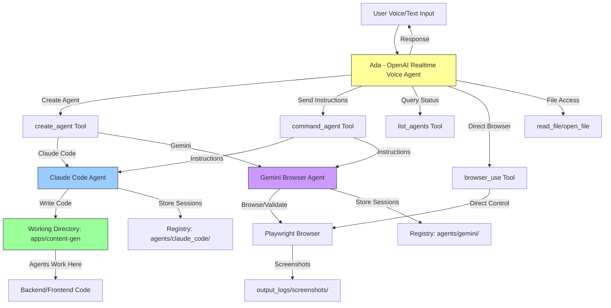

# Big Three Super Agent - Ada

> Voice-controlled AI orchestrator that manages coding agents (Claude Code) and browser agents (Gemini Computer Use)
>
> **See this codebase in action [here](https://youtu.be/Ur3TJm0BckQ)**
>


Meet **Ada** - your AI orchestrator that creates, manages, and coordinates multiple specialized AI agents through natural voice or text commands.

## What Ada Can Do

**Ada is a unified voice-controlled orchestrator** that coordinates three types of AI agents:
1. **OpenAI Realtime Voice Agent** - Natural voice interactions and orchestration (Ada herself)
2. **Claude Code Agents** - Software development, coding, and file operations
3. **Gemini Browser Agents** - Web automation, research, and validation

### Core Capabilities

**🎤 Voice Orchestration**
- Natural language voice commands (or text mode)
- Real-time conversation with AI agents
- Multi-turn context awareness
- Token usage and cost tracking

**👨‍💻 Agent Creation & Management**
- Create unlimited coding agents (Claude Code)
- Create unlimited browser agents (Gemini)
- List all active agents and their status
- Delete agents when done
- Resume existing agent sessions
- Check agent task results

**💻 Software Development (via Claude Code Agents)**
- Write, edit, and refactor code
- Create new files and directories
- Run terminal commands
- Install dependencies
- Debug and fix errors
- Read and analyze existing code
- Execute multi-step coding workflows

**🌐 Web Automation (via Gemini Browser Agents)**
- Navigate websites and search for information
- Extract data from web pages
- Interact with forms and buttons
- Take screenshots
- Perform multi-step browsing tasks
- Validate deployed applications

**📁 File Operations**
- Read files from working directory
- Open files in VS Code or default app
- Access project structure
- Review logs and outputs

**📊 Observability**
- Real-time event tracking
- AI-generated summaries for each action
- Session lifecycle monitoring
- Cost and usage reporting

## Requirements

- **Python 3.11+**
- **[Astral uv](https://docs.astral.sh/uv/)** - Fast Python package installer and runner
- **API Keys**: OpenAI, Anthropic (Claude), Google (Gemini)
- **Playwright**: For browser automation (`playwright install` after setup)

Install `uv` if you don't have it:
```bash
curl -LsSf https://astral.sh/uv/install.sh | sh
```

## Setup

### 1. Clone and Navigate
```bash
cd apps/realtime-poc
```

### 2. Configure Environment
Copy `.env.sample` to `.env` and fill in required values:

```bash
# Required API Keys
OPENAI_API_KEY=sk-...           # For voice orchestration
ANTHROPIC_API_KEY=sk-ant-...    # For Claude Code agents
GEMINI_API_KEY=...              # For browser automation

# Optional API Keys (for future extensibility)
GROQ_API_KEY=
DEEPSEEK_API_KEY=
ELEVENLABS_API_KEY=             # For advanced TTS

# Configuration
ENGINEER_NAME=Dan               # Your name (for agent interactions)
AGENT_WORKING_DIRECTORY=        # Leave empty to use default (apps/content-gen)
```

### 3. Install Playwright
```bash
playwright install
```

### 4. Run
```bash
# Voice mode (recommended for full experience)
uv run big_three_realtime_agents.py --voice

# Text mode (for testing)
uv run big_three_realtime_agents.py --input text --output text

# Auto-dispatch with prompt
uv run big_three_realtime_agents.py --prompt "Create a new claude code agent, and have it list all the files in the working directory"

# Use mini model (faster/cheaper)
uv run big_three_realtime_agents.py --mini --voice
```

## How to Use Ada

### Available Tools

Ada has 9 powerful tools at her disposal:

1. **`list_agents()`** - View all active agents (coding + browser)
   - Shows agent names, session IDs, types, and recent files
   - Use: "List all my agents" or "Show me what agents are running"

2. **`create_agent(tool, type, agent_name)`** - Create a new agent
   - **Coding Agent**: `tool='claude-code'`, `type='agentic-coding'`
   - **Browser Agent**: `tool='gemini'`, `type='agentic-browsering'`
   - Optional: Provide custom agent name
   - Use: "Create a new coding agent" or "Make a browser agent called WebScout"

3. **`command_agent(agent_name, prompt)`** - Give instructions to an agent
   - Send tasks to existing agents
   - Works with both coding and browser agents
   - Use: "Tell CodeBot to fix the backend API" or "Ask WebScout to search for Python tutorials"

4. **`delete_agent(agent_name)`** - Remove an agent
   - Deletes agent session and working directory
   - Use: "Delete the CodeBot agent"

5. **`check_agent_result(agent_name, operator_file_name)`** - Review agent outputs
   - Read status reports from coding agents
   - Check what the agent accomplished
   - Use: "Check what CodeBot did in the latest task"

6. **`browser_use(task, url)`** - Direct browser automation
   - One-off browsing tasks without creating an agent
   - Optional starting URL
   - Use: "Browse to example.com and get the pricing info"

7. **`open_file(file_path)`** - Open files
   - Opens in VS Code or default app
   - Relative to working directory
   - Use: "Open the frontend App.vue file"

8. **`read_file(file_path)`** - Read file contents
   - Get file contents for context
   - Relative to working directory
   - Use: "Read the backend config file"

9. **`report_costs()`** - View usage and costs
   - Token usage breakdown (text/audio)
   - Total cost in USD
   - Use: "How much have I spent?" or "Show me the cost report"

### Example Workflows

**🔧 Create and Manage a Coding Agent**

```bash
# Start Ada
uv run apps/realtime-poc/big_three_realtime_agents.py --voice

# Via voice or text:
You: "Create a new coding agent called BackendDev"
Ada: ✓ Created agent 'BackendDev' with session abc123

You: "Tell BackendDev to add error handling to the API routes"
Ada: ✓ Task dispatched to BackendDev

You: "List all agents"
Ada: [Shows table with BackendDev and recent files]

You: "Check what BackendDev did"
Ada: [Shows status report from operator file]

You: "Delete BackendDev"
Ada: ✓ Agent deleted
```

**🌐 Web Research with Browser Agent**

```bash
You: "Create a browser agent called WebScout"
Ada: ✓ Created browser agent 'WebScout'

You: "Ask WebScout to find the top 3 Python web frameworks and their Github stars"
Ada: [Browser agent navigates, searches, extracts data]
     ✓ Task completed: Found Django (70k), Flask (65k), FastAPI (68k)

You: "Tell WebScout to screenshot the FastAPI homepage"
Ada: ✓ Screenshot saved to output_logs/screenshots/
```

**📁 File Operations**

```bash
You: "Read the backend main.py file"
Ada: [Displays file contents]

You: "Open the frontend package.json"
Ada: ✓ Opened in VS Code

You: "What files are in the project?"
You: "Create a coding agent and have it list all files"
```

**💰 Cost Tracking**

```bash
You: "Report costs"
Ada: [Shows token usage and USD total]

     Tokens Used:
     - Input Text: 1,234 tokens
     - Input Audio: 5,678 tokens
     - Output Text: 890 tokens
     - Output Audio: 3,456 tokens
     Total Cost: $0.42 USD
```

### Agent Working Directory

By default, agents work in `apps/content-gen/`. You can change this:

```bash
# Edit .env
AGENT_WORKING_DIRECTORY=/path/to/your/project
```

All agent operations (file reads, writes, commands) are relative to this directory.

### Voice Commands Examples

**Agent Management:**
- "Create a new Claude Code agent"
- "Make a browser agent named Scout"
- "List all my agents"
- "Show me what CodeBot is working on"
- "Delete the Scout agent"

**Coding Tasks:**
- "Tell BackendDev to add user authentication"
- "Ask CodeBot to fix the TypeScript errors"
- "Have DevAgent refactor the database module"
- "Tell CodeBot to write unit tests for the API"

**Browser Tasks:**
- "Search Google for React best practices"
- "Go to news.ycombinator.com and get the top 5 stories"
- "Find the pricing for OpenAI's API"
- "Screenshot the homepage of example.com"

**File Operations:**
- "Read the README file"
- "Open the backend configuration"
- "Show me the package.json"
- "What's in the .env file?"

**Cost Tracking:**
- "How much have I spent?"
- "Show me the cost report"
- "What's my token usage?"

## Architecture



## Key Directories & Files

### Project Structure
```
big-3-super-agent/
├── .env.sample                 # Environment template
├── apps/
│   ├── content-gen/           # Agent working directory (default - you can change this to any directory you want)
│   │   ├── agents/            # Agent session registries
│   │   │   ├── claude_code/   # Claude Code agent sessions
│   │   │   └── gemini/        # Gemini agent sessions
│   │   ├── backend/           # Backend code (agents work here)
│   │   ├── frontend/          # Frontend code (agents work here)
│   │   ├── specs/             # Project specifications
│   │   └── logs/              # Agent execution logs
│   └── realtime-poc/          # Main orchestrator
│       ├── big_three_realtime_agents.py  # Main entry point
│       ├── prompts/           # System prompts for agents
│       │   └── super_agent/   # Orchestrator prompts
│       └── output_logs/       # Voice agent logs & screenshots
```

### Important Files

- **`big_three_realtime_agents.py`**: Main orchestrator script (3000+ lines)
  - Line 184-616: `GeminiBrowserAgent` class
  - Line 617-1540: `ClaudeCodeAgenticCoder` class
  - Line 1541-2900: `OpenAIRealtimeVoiceAgent` class

- **Working Directory**: `apps/content-gen/` (configurable via `AGENT_WORKING_DIRECTORY`)
  - All Claude Code agents operate with this as their `cwd`
  - Agents create/modify files relative to this directory
  - Registries stored in `agents/` subdirectory

## How Ada Works

### 1. Voice Orchestration Layer
**Ada** (the OpenAI Realtime Voice Agent) is your main interface:
- Listens to natural language voice/text input
- Understands intent and decides which tools to use
- Dispatches tasks to coding or browser agents
- Manages the full agent lifecycle
- Provides real-time feedback and results

### 2. Agent Registry System
Ada maintains two registries for tracking agents:
- **Claude Code Registry**: `apps/content-gen/agents/claude_code/registry.json`
- **Gemini Browser Registry**: `apps/content-gen/agents/gemini/registry.json`

Each registry stores:
- Agent name and session ID
- Creation timestamp
- Tool and type information
- Operator files (for coding agents)
- Session status

### 3. Multi-Agent Coordination
Ada can manage multiple agents simultaneously:
- **Parallel Tasks**: Different agents working on separate tasks
- **Sequential Tasks**: One agent building on another's work
- **Hybrid Workflows**: Coding agents create apps, browser agents validate them

Example workflow:
```
1. You: "Create a coding agent called Backend"
2. Ada: Creates Backend agent
3. You: "Tell Backend to build a REST API"
4. Ada: Dispatches task to Backend
5. You: "Create a browser agent called Tester"
6. Ada: Creates Tester agent
7. You: "Have Tester validate the API endpoints"
8. Ada: Tester opens browser and tests API
```

### 4. Session Persistence
- Agents persist across conversations
- Resume existing agents by name
- Operator files track coding task history
- Browser sessions maintain state

### 5. Working Directory Structure
All agents operate relative to the working directory (default: `apps/content-gen/`):

```
apps/content-gen/
├── agents/                    # Agent registries
│   ├── claude_code/
│   │   ├── registry.json      # Coding agent sessions
│   │   └── <agent_name>/      # Individual agent workspaces
│   └── gemini/
│       └── registry.json      # Browser agent sessions
├── backend/                   # Code that agents modify
├── frontend/                  # Code that agents modify
└── specs/                     # Project specifications
```

## Quick Tips

**🎯 Best Practices:**
- Give agents descriptive names: "BackendDev", "UIDesigner", "TestRunner"
- Use `list_agents()` before creating new agents to avoid duplicates
- Check agent results with `check_agent_result()` before giving new instructions
- Delete unused agents to keep registry clean
- Use text mode for testing: `--input text --output text`

**💡 Pro Tips:**
- **Chain tasks**: "Tell BackendDev to create an API, then have UIDesigner build a form for it"
- **Parallel work**: Create multiple agents for different modules
- **Browser validation**: After coding changes, use browser agent to test
- **Cost management**: Use `--mini` flag for cheaper/faster model
- **File context**: Read files first before commanding agents for better context

**⚠️ Common Patterns:**
```bash
# Development workflow
1. List agents to see what's active
2. Create or resume a coding agent
3. Command agent with specific task
4. Check results
5. Iterate or deploy

# Testing workflow
1. Create browser agent
2. Command to navigate and validate
3. Check screenshots in output_logs/
4. Report findings
```

**🔧 Debugging:**
- Check logs: `apps/realtime-poc/output_logs/`
- Review operator files in agent workspaces
- Use `read_file()` to inspect configurations
- Enable verbose logging in `.env`

## Real-World Use Cases

### 🚀 Full-Stack Development
```bash
You: "Create a coding agent called FullStack"
Ada: ✓ Created agent

You: "Tell FullStack to build a todo app with FastAPI backend and React frontend"
Ada: ✓ Task dispatched [FullStack creates backend/frontend files]

You: "Create a browser agent called QA"
Ada: ✓ Created agent

You: "Have QA test the todo app at localhost:3000"
Ada: ✓ [QA opens browser, tests CRUD operations, takes screenshots]
```

### 📊 Data Analysis & Reporting
```bash
You: "Create a browser agent called DataScout"
You: "Tell DataScout to go to company-dashboard.com and extract Q4 metrics"
Ada: [Extracts revenue, user count, conversion rates]

You: "Create a coding agent called Analyst"
You: "Tell Analyst to create a Python script that generates charts from this data"
Ada: [Creates data visualization script]
```

### 🔍 Code Review & Refactoring
```bash
You: "List all agents"
Ada: [Shows no agents]

You: "Create a coding agent called Reviewer"
You: "Tell Reviewer to analyze the backend code for security issues"
Ada: [Reviews code, generates report]

You: "Read the report file"
Ada: [Shows security findings]

You: "Create another agent called Fixer"
You: "Tell Fixer to implement the security recommendations"
Ada: [Makes code changes]
```

### 🌐 Web Research & Automation
```bash
You: "Create a browser agent called ResearchBot"
You: "Ask ResearchBot to find the top 5 competitors and their pricing"
Ada: [Navigates multiple sites, compiles pricing table]

You: "Tell ResearchBot to screenshot each pricing page"
Ada: [Saves screenshots to output_logs/]
```

### 🧪 Testing & QA
```bash
You: "Create coding agent called TestWriter"
You: "Tell TestWriter to write unit tests for the API module"
Ada: [Creates test files with pytest]

You: "Create coding agent called TestRunner"
You: "Tell TestRunner to run the tests and fix any failures"
Ada: [Runs tests, fixes issues, re-runs]

You: "Create browser agent called E2ETester"
You: "Have E2ETester perform end-to-end testing of the checkout flow"
Ada: [Browser automation testing]
```

### 📝 Documentation
```bash
You: "Create coding agent called DocWriter"
You: "Tell DocWriter to generate API documentation from the backend code"
Ada: [Analyzes code, creates OpenAPI/Swagger docs]

You: "Tell DocWriter to create a user guide README"
Ada: [Writes comprehensive README.md]
```

### 🔄 Multi-Agent Collaboration
```bash
You: "Create agents: Backend, Frontend, Tester"
Ada: ✓ Created 3 agents

You: "Tell Backend to add user authentication"
You: "Tell Frontend to create a login form"
You: "Tell Tester to validate the auth flow"
Ada: [All agents work in parallel/sequence]

You: "List agents"
Ada: [Shows all 3 agents with recent files]
```

## Multi Agent Observability

This project includes built-in observability for tracking all agent activities in real-time. The system uses [Claude Code Hooks Multi-Agent Observability](https://github.com/disler/claude-code-hooks-multi-agent-observability) to stream events from all agents to a centralized dashboard.

### How It Works

**Zero setup required** - just turn it on and agents automatically ping out events:

1. **Claude Code Hooks** (`.claude/settings.json`): Automatically triggered on tool use, notifications, session stops, etc.
2. **Send Event Hook** (`.claude/hooks/send_event.py`): Forwards hook events to the observability server with AI-generated summaries
3. **OpenAI Agent Integration**: The `_send_observability_event` tool in `big_three_realtime_agents.py` sends custom events from the voice orchestrator

### What You See

- **Real-time event stream**: Every tool call, agent creation, file operation, and browser action
- **AI-generated summaries**: Automatic context-aware descriptions of what's happening
- **Session tracking**: Follow multiple agent sessions across the entire lifecycle
- **Cost monitoring**: Track API usage via the `report_costs()` tool
- **Chat transcripts**: Full conversation history included on session stops

### Quick Start

1. Clone and run the observability server:
   ```bash
   git clone https://github.com/disler/claude-code-hooks-multi-agent-observability
   cd claude-code-hooks-multi-agent-observability
   npm install && npm run dev
   ```

2. Start the agents (observability is already configured):
   ```bash
   uv run big_three_realtime_agents.py --voice
   ```

3. Open the dashboard at `http://localhost:3000`

Events automatically flow from:
- Claude Code agent tool calls (PreToolUse, PostToolUse)
- Voice orchestrator decisions
- Gemini browser actions
- Session lifecycle events

No configuration needed - it just works!

## Built With

This project is powered by cutting-edge AI technologies:

- **[Gemini 2.5 Computer Use](https://blog.google/technology/google-deepmind/gemini-computer-use-model/)** - Browser automation with vision and action planning
- **[OpenAI Realtime API](https://platform.openai.com/docs/guides/realtime)** - Natural voice interactions and orchestration
- **[OpenAI Sora API](https://platform.openai.com/docs/guides/video-generation)** - Video generation capabilities
- **[Claude Code](https://claude.com/product/claude-code)** - Agentic software development
- **[Astral uv](https://docs.astral.sh/uv/)** - Fast Python package management and script execution
- **[Tactical Agentic Coding](https://agenticengineer.com/tactical-agentic-coding)** - Agentic coding patterns and best practices

## Improvements

- **Break up large single agent**: `apps/realtime-poc/big_three_realtime_agents.py` is over 3000 lines of code, and although it's organized, it's still difficult to understand and maintain.
- **Error handling**: Add better recovery from API failures
- **Session persistence**: Store voice conversation history
- **Agent isolation**: Sandbox agent file operations more strictly
- **Cost tracking**: Monitor API usage per agent/session
- **Better logging**: Structured logging with trace IDs
- **Testing**: Add unit tests for each agent class
- **Configuration**: Move hardcoded values to config file
- **Agent interruption**: Enable agents to be interrupted and redirected by the voice agent
- **UI dashboard**: Web interface to monitor agent activities

## Future Directions

- **Multi-modal input**: Support image/video inputs for richer context
- **Agent templates**: Pre-configured agent profiles for common tasks
- **Tool extensions**: Plugin system for custom agent tools
- **Collaborative coding**: Multiple engineers working with same agents
- **Browser recording**: Record agent actions for debugging
- **Voice customization**: Train custom voice models
- **Mobile support**: iOS/Android companion apps
- **Cloud deployment**: Containerized deployment with Redis for state
- **Agent marketplace**: Share and discover agent configurations

## Troubleshooting

**"OPENAI_API_KEY not set"**: Ensure `.env` file exists and contains valid API key

**"playwright not found"**: Run `playwright install` after initial setup

**Agents not working in correct directory**: Check `AGENT_WORKING_DIRECTORY` in `.env`

**Voice not working**: Ensure microphone permissions granted and `pyaudio` installed

---

## Master AI **Agentic Coding**
> And prepare for the future of software engineering

Learn tactical agentic coding patterns with [Tactical Agentic Coding](https://agenticengineer.com/tactical-agentic-coding)

Follow the [IndyDevDan YouTube channel](https://www.youtube.com/@indydevdan) to improve your agentic coding advantage.

